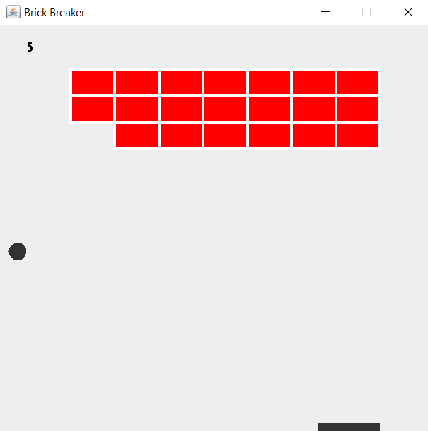

# BrickBreaker



<p>A simple brick breaker game made using Java.</p>

## How to play
Clone the repo and navigate to `out/artifacts/BrickBreaker_jar` and run the following command to start the game.
```
java -jar BrickBreaker.jar
```
Now press `s` to start the game and `a` and `d` to move the **launchpad** to left and right respectively.